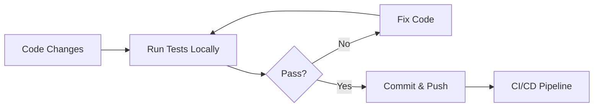

# Selenium E2E Testing - Execution & Best Practices Guide

## Quick Start (5 Minutes)

### 1. Install Dependencies
```bash
cd c:/CiviFix-Refactored/selenium_tests
pip install -r requirements.txt
```

### 2. Configure Environment
Create `.env`:
```env
FRONTEND_URL=http://localhost:3000
BROWSER=chrome
HEADLESS=false
IMPLICIT_WAIT=10
EXPLICIT_WAIT=15
TEST_CITIZEN_EMAIL=citizen@test.com
TEST_OTP=000000
TAKE_SCREENSHOTS=true
```

### 3. Start Frontend (Terminal 1)
```bash
cd c:/CiviFix-Refactored/civifix-web
npm run dev
# Frontend runs on http://localhost:3000
```

### 4. Run Tests (Terminal 2)
```bash
cd c:/CiviFix-Refactored/selenium_tests
python -m pytest test_scenarios.py -v
```

### 5. Generate Report
```bash
python run_tests.py
```

Report generated: `civifix_selenium_e2e_test_report.xlsx`

---

## Running Tests - Detailed Commands

### Run All Tests with Verbose Output
```bash
python -m pytest test_scenarios.py -v --tb=short
```

### Run Specific Test Class
```bash
python -m pytest test_scenarios.py::TestAuthentication -v
```

### Run Single Test
```bash
python -m pytest test_scenarios.py::TestAuthentication::test_login_scenarios -v
```

### Run with Markers
```bash
python -m pytest test_scenarios.py -v -m "not slow"
```

### Run in Parallel (faster execution)
```bash
python -m pytest test_scenarios.py -v -n auto
```

### Run with HTML Report
```bash
python -m pytest test_scenarios.py -v --html=report.html
```

---

## Troubleshooting

### Issue: Tests Timeout on OTP Screen
**Symptom:** `TimeoutException: Message:` after clicking CONTINUE

**Solutions:**
1. Ensure frontend is running: `npm run dev` in `civifix-web/`
2. Check frontend is accessible: `http://localhost:3000`
3. Increase timeout in `conftest.py`:
   ```python
   EXPLICIT_WAIT = 30  # Increase to 30 seconds
   ```

### Issue: PermissionError on Report Generation
**Symptom:** `PermissionError: [Errno 13] Permission denied: 'selenium_test_report.xlsx'`

**Solutions:**
1. Close Excel/CSV viewers
2. Use unique filename:
   ```python
   runner.generate_excel_report(f"report_{datetime.now().timestamp()}.xlsx")
   ```
3. Run as Administrator

### Issue: Chrome Driver Not Found
**Symptom:** `WebDriver not found`

**Solutions:**
1. Reinstall webdriver-manager:
   ```bash
   pip install --upgrade webdriver-manager
   ```
2. Clear cache:
   ```bash
   rm -r ~/.wdm/
   ```
3. Run tests again (will auto-download)

### Issue: Element Not Found
**Symptom:** `NoSuchElementException`

**Debugging Steps:**
1. Add screenshot before error:
   ```python
   page.screenshot("debug_screenshot.png")
   ```
2. Open screenshot and inspect element
3. Update locator in page object file
4. Test locator with:
   ```python
   driver.find_element(By.XPATH, "//button[@id='test']")
   ```

---

## Writing New Tests

### Test Template
```python
def test_new_workflow(self, driver, test_context):
    """Test description"""
    test_context['test_id'] = "TEST_001"
    test_context['scenario'] = "Test Name"
    
    page = SomePage(driver, TestConfig)
    page.navigate_to(f"{TestConfig.FRONTEND_URL}/path")
    
    try:
        # Perform actions
        page.click_button()
        page.enter_text("input text")
        
        # Assertions
        if page.is_element_present(page.SUCCESS_ELEMENT):
            test_context['actual_result'] = "Success"
            test_context['status'] = "PASS"
        else:
            test_context['actual_result'] = "Failed"
            test_context['status'] = "FAIL"
        
        page.screenshot(f"test_{test_context['status']}.png")
    except Exception as e:
        test_context['actual_result'] = f"Exception: {str(e)}"
        test_context['status'] = "FAIL"
        logger.error(f"Test failed: {str(e)}")
```

### Best Practices

1. **Use Page Objects**
   - Encapsulate page interactions
   - DRY principle - reuse locators
   - Easy to maintain

2. **Meaningful Locators**
   ```python
   # ❌ Bad - Too specific
   BUTTON = (By.XPATH, "//button[contains(text(), 'Submit') and @class='btn btn-primary rounded-lg']")
   
   # ✅ Good - Flexible and stable
   SUBMIT_BUTTON = (By.XPATH, "//button[contains(translate(normalize-space(.), 'abcdefghijklmnopqrstuvwxyz', 'ABCDEFGHIJKLMNOPQRSTUVWXYZ'), 'SUBMIT')]")
   ```

3. **Proper Waits**
   ```python
   # ❌ Bad - No wait
   element = driver.find_element(By.ID, "dynamic-element")
   
   # ✅ Good - Explicit wait
   element = WebDriverWait(driver, 10).until(
       EC.presence_of_element_located((By.ID, "dynamic-element"))
   )
   ```

4. **Error Handling**
   ```python
   try:
       page.perform_action()
   except TimeoutException:
       page.screenshot("timeout_error.png")
       raise AssertionError("Action timed out")
   ```

5. **Test Independence**
   - Each test should be independent
   - Don't rely on other tests passing
   - Use fixtures for setup/teardown

---

## Page Object Pattern

### Structure
```python
class LoginPage(BasePage):
    # Locators at class level
    EMAIL_INPUT = (By.ID, "email-input")
    SUBMIT_BUTTON = (By.XPATH, "//button[contains(text(), 'Continue')]")
    
    # Methods for interactions
    def enter_email(self, email):
        self.type_text(self.EMAIL_INPUT, email)
    
    def click_continue(self):
        self.click_element(self.SUBMIT_BUTTON)
    
    # High-level workflows
    def login(self, email):
        self.enter_email(email)
        self.click_continue()
```

### Usage in Tests
```python
page = LoginPage(driver, config)
page.navigate_to("http://localhost:3000/login")
page.login("test@example.com")
```

---

## Test Execution Workflow

### Local Development


### CI/CD Pipeline (GitHub Actions)
```yaml
name: Selenium Tests

on: [push, pull_request]

jobs:
  test:
    runs-on: ubuntu-latest
    steps:
      - uses: actions/checkout@v2
      
      - name: Setup Python
        uses: actions/setup-python@v2
        with:
          python-version: '3.11'
      
      - name: Install Dependencies
        run: |
          cd selenium_tests
          pip install -r requirements.txt
      
      - name: Start Frontend (Background)
        run: |
          cd civifix-web
          npm install
          npm run build
          npm run start &
          sleep 10
      
      - name: Run Tests
        run: |
          cd selenium_tests
          python -m pytest test_scenarios.py -v
      
      - name: Generate Report
        if: always()
        run: |
          cd selenium_tests
          python run_tests.py
      
      - name: Upload Report
        uses: actions/upload-artifact@v2
        if: always()
        with:
          name: test-report
          path: selenium_tests/*.xlsx
```

---

## Performance Optimization

### Parallel Test Execution
```bash
# Run 4 tests in parallel
python -m pytest test_scenarios.py -v -n 4
```

### Headless Mode (Faster)
```env
HEADLESS=true
```

### Implicit Wait Optimization
```python
# Keep implicit wait low for fast failures
IMPLICIT_WAIT=5
# Use explicit waits where needed
```

---

## Debugging Tips

### 1. Screenshot on Failure
```python
try:
    page.perform_action()
except Exception as e:
    page.screenshot("debug_failure.png")
    raise
```

### 2. Print DOM
```python
page.driver.execute_script(
    "console.log(document.body.outerHTML)"
)
```

### 3. Debug Element Location
```python
elements = driver.find_elements(By.XPATH, "//button")
for i, elem in enumerate(elements):
    print(f"Button {i}: {elem.text}")
```

### 4. Slow Motion Execution
```python
driver.set_script_timeout(10)
time.sleep(2)  # Add delays between actions
```

---

## Maintenance Checklist

### Weekly
- [ ] Run full test suite
- [ ] Review failed tests
- [ ] Update broken locators

### Monthly
- [ ] Review test coverage
- [ ] Update documentation
- [ ] Optimize slow tests

### Quarterly
- [ ] Refactor duplicated code
- [ ] Add new test scenarios
- [ ] Review and update dependencies

---

## Common XPath Patterns

```xpath
# By ID
//input[@id='email-input']

# By placeholder
//input[@placeholder='Enter email']

# By text content
//button[text()='Submit']

# By partial text (case-insensitive)
//button[contains(translate(normalize-space(.), 'abcdefghijklmnopqrstuvwxyz', 'ABCDEFGHIJKLMNOPQRSTUVWXYZ'), 'SUBMIT')]

# By class
//button[@class='btn btn-primary']

# By multiple attributes
//button[@id='submit' and @type='submit']

# Parent/Child
//form//button[@type='submit']

# Preceding sibling
//button[@type='submit']/preceding-sibling::input[@type='text']

# Following element
//label[text()='Email']/following-sibling::input

# Index
//button[1]  # First button
//button[last()]  # Last button
//button[position()=2]  # Second button
```

---

## Test Data Management

### Environment Variables
```python
# conftest.py
TEST_USER_EMAIL = os.getenv('TEST_USER_EMAIL', 'test@example.com')
TEST_USER_PASSWORD = os.getenv('TEST_USER_PASSWORD', 'password123')
```

### Fixtures for Test Data
```python
@pytest.fixture
def test_user():
    return {
        'email': 'test@example.com',
        'password': 'Test@12345',
        'name': 'Test User'
    }

def test_login(driver, test_user):
    page = LoginPage(driver, TestConfig)
    page.login(test_user['email'])
```

---

## Reporting

### View Report
1. Open `civifix_selenium_e2e_test_report.xlsx` in Excel
2. Navigate to "Test Results" sheet
3. View:
   - Test ID, Module, Scenario
   - Pass/Fail status (color-coded)
   - Execution time
   - Screenshots

### Generate Custom Report
```python
from run_tests import SeleniumTestRunner

runner = SeleniumTestRunner()
runner.generate_excel_report('custom_report.xlsx')
```

---

## Additional Resources

- [Selenium Documentation](https://www.selenium.dev/documentation/)
- [Pytest Documentation](https://docs.pytest.org/)
- [Page Object Model](https://www.selenium.dev/documentation/test_practices/encouraged/page_object_models/)
- [XPath Cheatsheet](https://devhints.io/xpath)

---

**Last Updated:** June 17, 2026  
**Version:** 1.0.0  
**Status:** Production Ready ✅
